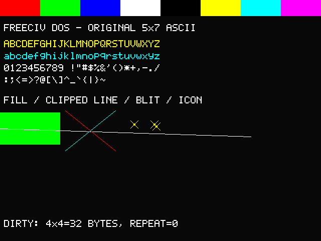

# FreeCiv-DOS

**An experimental, independent DOS port of Freeciv 1.14.1, using DJGPP and a
32-bit DPMI protected-mode runtime.**

The goal is a playable, offline, single-player graphical Freeciv on DOS 6.22,
with AI opponents, on a Pentium 100 / 16 MB-class machine. This is not a new game
engine, a 16-bit rewrite, or a text-mode adaptation: it reuses Freeciv's existing
rules, AI, server engine and client logic while replacing the platform-facing
parts needed for DOS.

> **Development status: rendering foundations are working; the game is not
> playable yet.** The normal DOS client deliberately exits with an explicit
> unavailable-integration diagnostic. Separate diagnostics verify real DOS,
> DPMI, graphics and rendering behavior without pretending to be a complete game.

## Upstream project and credit

This project is based on **[Freeciv](https://www.freeciv.org/)**, the free,
open-source turn-based strategy game:

- [Upstream Freeciv source repository](https://github.com/freeciv/freeciv)
- [Original contributor credits included with this source](freeciv-1.14.1/doc/PEOPLE)
- [Upstream copyright and license](freeciv-1.14.1/COPYING)

The historical source used here is **Freeciv 1.14.1 from the Red Hat 9 source
RPM**. The supplied `freeciv-1.14.1-2.RH9.0.i386.rpm` was also examined locally
as a reference for the original game's packaged assets.

Credit for the original game, gameplay systems, AI, graphics, rulesets,
documentation and other upstream contributions belongs to the Freeciv authors
and their respective contributors. Original file notices and the historical
contributor list are preserved. DOS-specific additions do not transfer
ownership of the upstream work.

This is an independent porting project, **not an official Freeciv release**.
It targets a historical version rather than current Freeciv, and does not claim
to include modern upstream fixes or feature compatibility.

## Intended experience and target hardware

| Area | Target |
| --- | --- |
| Operating system | DOS 6.22 |
| CPU | Pentium 100 minimum goal |
| RAM | 16 MB minimum goal |
| Execution | One 32-bit DJGPP/DPMI protected-mode application |
| Graphics | VESA 2.0+ RGB565 linear framebuffer |
| Required resolution | 640x480, 16-bit |
| Preferred resolution | 800x600, 16-bit |
| Gameplay | Offline single player against AI |
| Controls | Keyboard, plus DOS mouse-driver support where available |
| Audio | DOS-native sound/music where practical, with a usable no-audio mode |

The final game should support setup, map play, reports, saves, loading and
complete turns without an external server or network connection. Networked
multiplayer, Linux GUI libraries and porting SDL/ESD audio stacks are outside
this DOS target.

**The hardware numbers are goals, not completed whole-game acceptance.**
Component/render diagnostics run with 16 MB and paging disabled; full-game
memory use and Pentium 100 performance still need measurement. Optional
1024x768 and broad physical-adapter compatibility are not certified.

The implemented display path additionally requires BIOS VBE `4F04h` state
save/restore and a DPMI host with the `0508h` managed-device-mapping extension.
CWSDPMI r7 is the tested host. Banked-only adapters and non-RGB565 layouts fail
explicitly rather than falling back to an invisible RAM-only display.

## How the port is being built

### Keep the original authoritative engine

Freeciv normally separates its client from a server process. For DOS, the plan
is one executable containing both the client and an **isolated embedded
authoritative engine**, with a copied-byte in-memory packet bridge between them.

The engine reuses the existing server/common/AI sources. Its global symbols
are isolated from the client-side cache, and only a small opaque API crosses
that boundary. Ordered requests and cooperative scheduling preserve the
authoritative rules instead of replacing gameplay with client-side shortcuts.
The architecture and component tests are in [client/offline](freeciv-1.14.1/client/offline/).
Connecting this foundation to the finished user-driven GUI remains unfinished.

### Replace the platform layer, not the game rules

The [DOS VBE backend](freeciv-1.14.1/client/gui-dos-vbe/) supplies real BIOS/DPMI
video services, an offscreen RGB565 buffer, clipped rendering primitives and
dirty presentation. It saves/restores the original text display and releases
managed video mappings.

The original printable-ASCII bitmap font is embedded and licensed under
GPL-2.0-or-later; no third-party font was copied. It is a working fallback, not
the final encoding/layout solution: accented game names, font metrics and
remaining dialog/report integration still need deliberate handling.

DOS-specific changes are kept behind the backend and compatibility boundaries.
Shared gameplay logic and supported upstream targets are not broadly rewritten.
Historical link-only ABI stubs are excluded from the production executable.

### Build and test from recorded inputs

[build-dos.sh](freeciv-1.14.1/build-dos.sh) snapshots source, regenerates autotools
inputs, cross-builds out of tree and checks archive membership, engine isolation
and important symbols. It does not trust old objects or executables left in the
checkout. Build records describe the exact toolchain and inputs; binary hashes
can differ between build locations because of debug paths and tool timestamps.

Native behavioral tests use ASan/UBSan, and separate target diagnostics exercise
actual DOS/BIOS/DPMI services. Emulated visible VGA output is checked against
reference pixels, not just an offscreen buffer.

## Current progress

As of **2026-10-07**, checklist **Phases 1-5 are complete at their documented
foundation boundaries**. Phase 6 is paused pending review and authorization.

| Foundation | What has been verified |
| --- | --- |
| Offline architecture | Isolated engine, copied packets, ordered requests, client-state separation and cleanup; native real-game component tests exercise generation, AI and turns |
| Reproducible build | Clean DJGPP linkage of real backend modules, broker and embedded engine; source distributions and interface checks |
| DOS runtime | DOS 6.22 boot/drive layout, CWSDPMI r7, real DOS/DPMI calls, heap/conventional transfer, resource-path fixture and engine join/reset diagnostic |
| VBE lifecycle | Real enumeration/metadata, mode selection, RGB565 LFB mapping/presentation, fallbacks, state/text restoration and resource release |
| Rendering | Clipped fill/line/blit/icon/text, original font, checked allocation/pitch, viewport-relative partial updates and dirty-region presentation |

Latest rendering verification includes:

- A clean **28-module** DOS backend archive, with no diagnostic ABI stubs.
- **5/5 integrated backend tests passing**, including behavioral sanitizer suites.
- Actual DOS diagnostics at **640x480 and 800x600**, with 16 MB and paging disabled.
- **307,200 and 480,000 matching visible VGA pixels**, respectively, with zero mismatches.
- A 4x4 update writing **32 bytes**, a clean repeat writing **0 bytes**, and nearby
  coalesced updates writing **12 bytes**.
- Real Q input, restored DOS text contents, repeated launch and subsequent
  runtime/engine regression.



This is a **primitive/font diagnostic**, not a screenshot of playable Freeciv.
See the [Phase 5 evidence summary](builds/phase5-dos/BUILDINFO.txt) and
[pixel verification](builds/phase5-dos/pixel-verification.json).

### Major work still ahead

The next work connects these foundations into an actual game:

- Real graphics-resource loading, sprites/atlases, transparency and DOS filename handling.
- A playable map with correct visibility/fog, units, cities, scrolling and selection.
- Complete HUD, menus, dialogs and reports with consistent text metrics/character coverage.
- Persistent keyboard/mouse/event servicing and client/engine update integration.
- End-to-end game setup, authoritative actions, AI turns, save/load and completion.
- Honest DOS audio support or a reliable disabled-audio configuration.
- Filesystem/error handling, packaging, licensing checks and final memory/performance
  and physical-hardware validation.

Those are planned requirements, not implemented features. The full task list is
in [checklist.txt](checklist.txt); this README intentionally summarizes it.

## Building

Use a Linux or compatible POSIX cross-build host with:

- A real DJGPP cross toolchain (`i586-pc-msdosdjgpp-*`).
- Autoconf/Autoheader, Automake/Aclocal, GNU Make and GNU tar.
- Gettext's `config.rpath` support file and ordinary shell/file/hash utilities.
- A host C compiler with ASan/UBSan for native behavior tests.

The verified reference versions are DJGPP GCC 12.2.0, Binutils 2.30,
Autoconf 2.71 and Automake 1.16.5. These tools are not bundled or automatically
downloaded by the project.

From the repository root:

```sh
export PATH=/path/to/djgpp/bin:$PATH
sh freeciv-1.14.1/build-dos.sh /tmp/freeciv-dos-build
```

The destination must **not exist**, its parent must exist, and the build path
must be outside the source tree without spaces or colons. The checkout itself
may contain spaces.

The resulting candidate is:

```text
/tmp/freeciv-dos-build/build/client/civclient.exe
```

The build selects the `dos-vbe` client, embedded offline engine, disabled
standalone server/network transport, disabled NLS and no external GUI/audio
library requirements. `configure.ac` and `Makefile.am` are authoritative;
legacy `configure.in` is not the DOS regeneration input.

**A successful build is not a playable release.** `--version` works; normal
startup intentionally fails until required production integration is ready.

## Tests and separate DOS diagnostics

Run the host backend tests from the repository root:

```sh
sh freeciv-1.14.1/client/gui-dos-vbe/dos_vbe_backend_check.sh
sh freeciv-1.14.1/client/gui-dos-vbe/vbe_check.sh
sh freeciv-1.14.1/client/gui-dos-vbe/dpmi_check.sh
sh freeciv-1.14.1/client/gui-dos-vbe/framebuffer_check.sh
sh freeciv-1.14.1/client/gui-dos-vbe/mapview_check.sh
```

The first is a source-presence smoke check, not gameplay validation. The other
four exercise real implementations with controlled host services and sanitizers.
After a cross-build, the integrated suite is also available through:

```sh
make -C /tmp/freeciv-dos-build/build/client/gui-dos-vbe check
```

Build target diagnostics into separate, nonexistent directories:

```sh
export PATH=/path/to/djgpp/bin:$PATH
sh freeciv-1.14.1/client/gui-dos-vbe/build-vbe-check.sh /tmp/freeciv-vbe-check
sh freeciv-1.14.1/client/gui-dos-vbe/build-render-check.sh /tmp/freeciv-render-check
sh freeciv-1.14.1/client/offline/build-runtime-check.sh \
  /tmp/freeciv-runtime-check /tmp/freeciv-dos-build/build
```

These produce `VBECHECK.EXE`, `RNDCHECK.EXE` and `RTCHECK.EXE`. They are not part
of the production GUI archive. Use your own licensed DOS installation, a
supported display and the documented CWSDPMI configuration.

For example, with the diagnostic/runtime installed in `C:\FREECIV`:

```text
CD \FREECIV
CWSDPMI -s-
RNDCHECK 640 > RND640.LOG
```

Press Q to restore text mode, then inspect the log. Repeat `CWSDPMI -s-`
immediately before each no-paging application; that setting applies to one
DPMI process. `RNDCHECK 800 > RND800.LOG` tests the preferred resolution.
See [dos_boot_steps.txt](dos_boot_steps.txt) for the full procedure and limitations.
QEMU, Python 3, mtools and FAT/partition utilities are needed for the recorded
VM/image validation workflow, not for every native test.

## Repository contents and local-only material

| Path | Purpose |
| --- | --- |
| [freeciv-1.14.1/](freeciv-1.14.1/) | Historical upstream source/data plus DOS port changes |
| [client/gui-dos-vbe/](freeciv-1.14.1/client/gui-dos-vbe/) | DOS graphics/rendering backend, diagnostics and tests |
| [client/offline/](freeciv-1.14.1/client/offline/) | Embedded-engine isolation, in-memory transport and tests |
| [runtime/cwsdpmi-r7/](runtime/cwsdpmi-r7/) | Unchanged supplier runtime, notices and original binary/source archives |
| [dos-vm/](dos-vm/) | Boot configuration, partition tooling and historical scaffold source; no DOS disk images |
| [builds/](builds/) | Retained text/image/configuration validation records; not a binary release |
| [old/](old/) | Archived, superseded documents; not current requirements |

Public Git history deliberately excludes:

- DOS boot/hard-drive images and recovery copies, which contain separately
  licensed operating-system files.
- Original RPM archives and their separately extracted Linux-package reference
  tree. The upstream source tree already includes the graphics/ruleset reference
  data; additional packaged audio is not silently redistributed here.
- Generated game executables, objects/libraries and duplicate source archives.
- Local editor settings, credentials and swap files.

These exclusions do not delete the local material. Some historical evidence
and boot documents reference local images, binaries or absolute build paths;
those references document the original validation environment, not files
provided by a clone. Rebuild executables locally. Image verification requires
your own DOS installation and the relevant locally retained baseline/candidate.

### Current documentation

- [DOS_PORT_SPEC.md](DOS_PORT_SPEC.md): stable target and technical contracts.
- [checklist.txt](checklist.txt): detailed requirements and verified completion.
- [cleanup.txt](cleanup.txt): narrowly scoped source/build cleanup and outstanding issues.
- [progress.txt](progress.txt): chronological work and validation history.
- [dos_boot_steps.txt](dos_boot_steps.txt): DOS setup, diagnostic and recovery procedures.

Development proceeds one authorized phase at a time. Completed phases stop for
review; future features are not inferred from successful component diagnostics.

## Licensing and redistribution

Freeciv is distributed under the GNU GPL; preserve the original notices and the
version/option stated in each file. The [root LICENSE](LICENSE) is a verbatim copy
of the upstream GPL version 2 text. DOS additions, including the original bitmap
font, use GPL-2.0-or-later where stated. Do not interpret this as relicensing
every bundled third-party component.

CWSDPMI is copyright **Charles W. Sandmann** and has its own supplier
redistribution conditions. Its binaries are unchanged; the corresponding source
archive is included. Users have the right to obtain source/binary updates:
see [the runtime notices](runtime/cwsdpmi-r7/bin/cwsdpmi.doc),
[runtime provenance](runtime/cwsdpmi-r7/README.txt), and the
[supplier source archive](https://www.delorie.com/pub/djgpp/current/v2misc/csdpmi7s.zip).

DOS itself and a DJGPP toolchain are not redistributed here. If distributing
new game binaries or converted assets, provide the required corresponding source
and preserve all applicable upstream/asset/runtime attribution and licenses.
